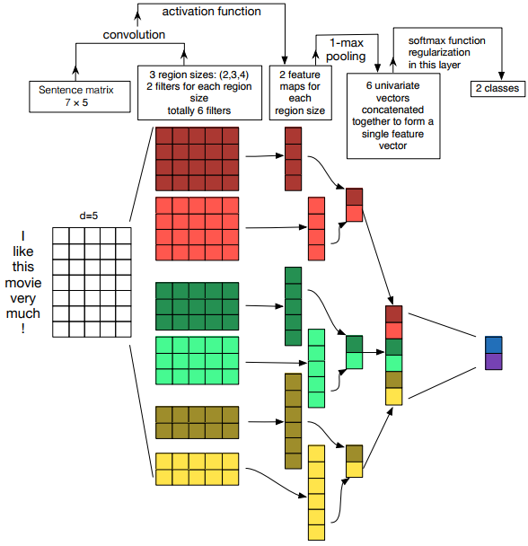

# Tasks

## Task 1-1: Predict the topic labels of discussions

### Purpose

We apply the natural language technologies, such as n-gram and stemming, we've learned in class to generate useful features and evaluate their effectiveness on classifying argument discussions into 10 labeled topic groups. The architecture for this task is as below:

According to our observation, people often use different keywords when discussing different topics. We propose a keyword-based approach to classify discussions into topics. The intuition is to identify keywords that are not generally used but only used in some specific topics, so we can classify a discussion based on the keywords occurred in the discussion. Therefore, we develop a stemmed unigram representation to represent a discussion. We compare this representation with the state-of-the-art Doc2Vec (Le and Mikolov, 2014) model. In the experiments, we evaluate the effectiveness of stemmed unigram and Doc2Vec in a classification task.

### Preprocessing and Feature Extraction

#### Stemmed Unigram

For each discussion, 
1. We filtered characters that are neither numbers nor english letters (e.g. "[A-Za-z0-9]" in regular expression). 
2. We filtered stopwords in text. The stopword list, which contains 2,400 stopwords for 11 languages, is from the stopword corpus created by Porter et al. (2001). 
3. We adopted Porter stemmer to convert words in discussions to their stemmed form. There are 98,988 distinct stems used in our dataset.
4. We took the stems as unigrams and built an unigram occurrence vector as the representation of discussion.

Since the number of unigrams is large, most of representation vectors are sparse. It is an known issue which may affect classification performance. Our future goal would be adopt some dimension reduction methods to reduce the size of feature vectors.

#### Doc2Vec

The Doc2Vec model is pre-trained using AP-NEWS corpus (Lau and Baldwin, 2016), which contains 25 million documents and 0.9 billion tokens. All posts in a discussion are concatenated as a document. Each document is converted into a Doc2Vec vector. We set the number of vector dimension as 300, which is the default value of the Doc2Vec implementation we used.

### Experiments

The figure below shows the distribution of topics. We split the dataset into 75% stratified training data and 25% testing data. 

| Topic        | # of discussions  |
| ------------- |:-------------:|
| abortion | 564 |
| climate change | 40 |
| communism vs capitalism | 38 |
| death penalty | 25 |
| evolution | 871 |
| existence of God | 105 |
| gay marriage | 305 |
| gun control | 824 |
| healthcare | 81 |
| marijuana legalization | 13 |

#### Classification by SVM

We trained a multi-class SVM model with linear kernel (LIBSVM, proposed by Chang et al. (2011)). The experiment was conducted in 5-fold cross validation. The following are the mean accuracy values:

| Feature Representation | # of Feature Dimension | 1 round accuracy  | 2 round accuracy  | 3 round accuracy  | 4 round accuracy  | 5 round accuracy  | Mean accuracy |
| ------------- |:-------------|:-------------|:-------------|:-------------|:-------------|:-------------|:-------------:|
| Stemmed unigram  | 98988 | 88.54% | 88.33% | 85.89% | 86.71% | 88.42% | 87.58% |
| Doc2Vec  | 300 | 87.85% | 87.63% | 88.33% | 89.86% | 87.72% | 88.28% |

The average accuracy of the steammed unigram features is 87.58%, it shows that keyword-based representation performs well to recognize the topic of discussions. Comparing to the state-of-the-art Doc2Vec model (88.28%), both stemmed unigram and Doc2Vec are significantly effective in this task. However, the Doc2Vec model has more efficient training time since its feature vector is only 300 dimensions comparing to the stemmed unigram model's 98988 dimensions.

#### Classification by Convolutional Neural Network

We implemented a sentence classification model with convolutional neural network (CNN) introduced by Zhang and Wallace (2015). The figure below is their network structure. 

Since our computing power is limited, we randomly select 300 posts in each discussion, and convert every post into a Doc2Vec vector. If a discussion contains less than 300 posts, we added vectors with zeros for padding (i.e. if a discussion has 250 posts, we convert the 250 posts to 250 Doc2Vec vectors plus 50 vectors with zeros) because CNN takes a fixed input size. The following are the values of testing accuracy in different number of epochs.

|Doc2Vec| # of epochs | Accuracy |
| ------------- |: ------------- |:-------------:|
| | 1 | 75.73% |
| | 4 | 84.52% |
| | 8 | 83.96% |

## Task 2: Identify author stance in discussions

### Purpose

In a discussion, authors express their different stances toward a topic. We want to discover how to effectively identify an author's stance in a discussion based on his posts. Since the IAC dataset contains the annotations of author stance for discussions, we try to convert author posts in discussion to Doc2Vec representation and evaluate if the representation is effective on identifying user stance.

In our analysis, we performed clustering and a classification respectively to evaluate the performance of the Doc2Vec features.

### Preprocessing

For each discussion, we first identify the authors. For each author, we first filtered characters that are neither numbers nor english letters (e.g. "[A-Za-z0-9]" in regular expression) in his posts. All filtered posts were concatenated and converted to a Doc2Vec vector.

In IAC dataset, the author stance on a discussion is recorded as a combination of votes from annotators. Each annotator can vote "pro", "anti", or "other". We use the following rules to consider the majority vote as the label of author stance:
- If the number of "pro" votes equals to "anti", or "other" dominates, choose "other" as the stance label.
- If "pro" dominates, choose "pro" as the stance label.
- If "anti" dominates, choose "anti" as the stance label.

### Analysis by Kmeans clustering

We perform K-means clustering (Kanungo et al., 2002) with K=3 for every topic respectively. Our metrics is Adjusted Mutual Information Score (Vinh et al., 2010). The value of AMI is used to evaluate the extent of shared information between two clustering results. Below is the results of different topics:

| Topic | Adjusted Mutual Information Score (AMI) |
| ------------- |:-------------:|
| evolution | 0.027 |
| death penalty | 0.051 |
| healthcare | 0.080 |
| abortion | 0.023 |
| gay marriage | 0.026 |
| marijuana legalization | 0.089 |
| existence of God | 0.026 |
| gun control | 0.020 |
| communism vs capitalism | 0.056 |
| climate change | 0.009 |

According to the results, using Doc2Vec representation stand-alone is not effective on identifying author stance in discussions.

### Analysis by SVM classification

We follow the same settings in task 1 to train a three-class SVM model. The following are the accuracy values of 5-fold cross validation in different topics:

| Topic        | 1 round accuracy  | 2 round accuracy  | 3 round accuracy  | 4 round accuracy  | 5 round accuracy  | Mean accuracy |
| ------------- |:-------------|:-------------|:-------------|:-------------|:-------------|:-------------:|
| death penalty | 47.60% | 55.93% | 53.90% | 51.30% | 59.33% | 53.61% |
| healthcare | 55.71% | 42.86% | 45.71% | 52.17% | 67.65% | 52.82% |
| existence of God | 50.78% | 45.54% | 45.78% | 46.08% | 46.62% | 46.96% |
| marijuana legalization | 57.76% | 60.34% | 77.19% | 63.72% | 62.83% | 64.37% |
| gun control | 57.11% | 52.05% | 51.79% | 62.52% | 53.66% | 55.43% |
| evolution | 65.11% | 60.90% | 50.08% | 61.03% | 58.95% | 59.21% |
| communism vs capitalism | 73.33% | 81.48% | 60.45% | 53.38% | 49.24% | 63.58% |
| climate change | 42.86% | 46.58% | 54.48% | 52.41% | 41.67% | 47.60% |
| abortion | 50.49% | 55.05% | 54.50% | 44.64% | 59.00% | 52.74% |
| gay marriage | 67.66% | 64.15% | 66.95% | 61.47% | 59.83% | 64.01% |

The classification results show the Doc2Vec representation only performs  in most of topics.

### Reference

1. Porter, M. F. (2001). Snowball: A language for stemming algorithms.
2. Chang, C. C., & Lin, C. J. (2011). LIBSVM: a library for support vector machines. ACM transactions on intelligent systems and technology (TIST), 2(3), 27.
3. Le, Q., & Mikolov, T. (2014). Distributed representations of sentences and documents. In Proceedings of the 31st International Conference on Machine Learning (ICML-14) (pp. 1188-1196).
4. Lau, J. H., & Baldwin, T. (2016). An empirical evaluation of doc2vec with practical insights into document embedding generation. arXiv preprint arXiv:1607.05368.
5. Kanungo, T., Mount, D. M., Netanyahu, N. S., Piatko, C. D., Silverman, R., & Wu, A. Y. (2002). An efficient k-means clustering algorithm: Analysis and implementation. IEEE transactions on pattern analysis and machine intelligence, 24(7), 881-892.
6. Vinh, N. X., Epps, J., & Bailey, J. (2010). Information theoretic measures for clusterings comparison: Variants, properties, normalization and correction for chance. Journal of Machine Learning Research, 11(Oct), 2837-2854.
7. Zhang, Y., & Wallace, B. (2015). A sensitivity analysis of (and practitioners' guide to) convolutional neural networks for sentence classification. arXiv preprint arXiv:1510.03820.
